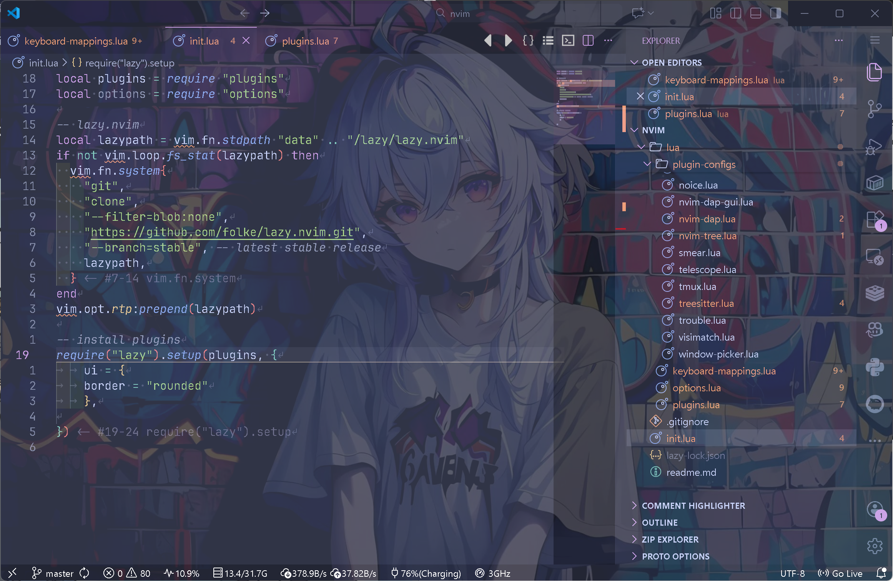
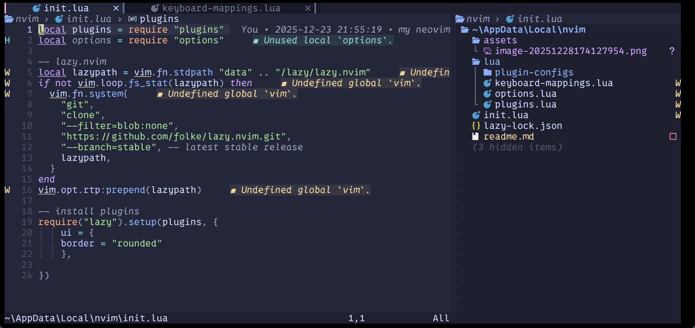

## My VsCode+NeoVim Configurations

This is a beginner-friendly configuration tutorial for VsCode and NeoVim. At the same time, it's also available for all those who want to use NeoVim in VsCode as a reference.





### Setup
download & install [Visual Studio Code](https://code.visualstudio.com/) and [NeoVim](https://github.com/neovim/neovim/releases)

1. install "VSCode Neovim" extension in the vscode
2. config `settings.json`, add:

- "vscode-neovim.neovimExecutablePaths.win32": "path_to_your_neovim/bin/nvim.exe",

- or  "vscode-neovim.neovimExecutablePaths.linux": "path_to_nvim" in the Linux

  > if you are using WSL, don't forget to add: "vscode-neovim.useWSL": true

4. cd to the neovim's configuration folder, "C:\\your_name\\AppData\\Local\\" in the Window system or "~/.config/" in the Linux system.
> sorry i'm not a mac user, but i think it's similar to Linux :)

5. clone this repository

```shell
git clone https://github.com/leeotus/nvim.git
```

After all the above operations done, your neovim configuration folder should be like (you may need to adjust your folder):

```markdown
Local/nvim/  # or ~/.config/nvim
├── init.lua
├── lua/
│   └── plugin-configs/
│       ├── keyboard-mappings.lua
│       ├── options.lua
│       └── plugins.lua
└── readme.md  # you are reading this file
...other files
```

### Key Mappings (Nvim)

> see keyboard-mappings.lua
>
> Note: some key mappings may depend on specific extensions in the vscode

First of all, the "<leader>" key is defined in options.lua.

```lua
-- options.lua
vim.g.mapleader = "\\"
```

just change it as you like.

I usually use "\<leader\>"-series shortcuts to quickly search (or jump to) something (or somewhere) in the current editor, and "\<space\>" to save/quit or move tabs... instead. I have been used to these operations, here lists my key mappings:

| key                   | binding                                        | operation                                                 |
| --------------------- | ---------------------------------------------- | --------------------------------------------------------- |
| J                     | 5j                                             | move downward faster                                      |
| K                     | 5k                                             | move upward faster                                        |
| Ctrl + s              | :w\<Enter\>                                    | save file                                                 |
| za                    | vscode.editor.toggleFold                       | fold or unfold content                                    |
| \<space\>q            | vscode.workbench.action.closeActiveEditor      | close current file                                        |
| \<space\>w            | vscode.workbench.action.files.save             | save current file                                         |
| ?                     | vscode.workbench.action.findInFiles            | search with selected word                                 |
| \<space\>p            | vscode.workbench.action.showCommands           | open commands (replaces ctrl + shift + p)                 |
| \<space\>o            | vscode.workbench.action.gotoSymbol             | show symbol panel (replaces ctrl + shift + o)             |
| \<space\>r            | vscode.editor.action.rename                    | rename a symbol                                           |
| \<space\>]            | vscode.workbench.action.moveEditorRightInGroup | extension MoveTab(@ahgood), move tab to the right         |
| \<space\>[            | vscode.workbench.action.moveEditorLeftInGroup  | move tab to the left                                      |
| \<space\>=            | vscode.workbench.action.nextEditor             | goto the next tab (replaces :gt)                          |
| \<space\>-            | vscode.workben.action.previousEditor           | goto the previous tab (replaces :gT)                      |
| \<leader\>\<leader\>w | HopWord                                        | neovim'extension, quickly jump to the beginning of a word |
| \<leader\>\<leader\>1 | HopChar1                                       | find 1 char                                               |
| \<leader\>\<leader\>2 | HopChar2                                       | find 2 char                                               |

the binding begins with 'vscode.' means that the corresponding keybinding is derived from one of the vscode's embedded functions. You can open your vscode's "Keyboard Shortcuts" to see them.

Some already embedded key-mappings when neovim-extension installed:

- select

| key       | operation       |
| --------- | --------------- |
| \<ctrl\>n | select next     |
| \<ctrl\>p | select previous |

These two key-bindings can be used in many situations, when selecting suggestions, selecting files, selecting commands...

- viewpoint

> these keys only work when your cursor focuses on the open editor

| key       | operation                        |
| --------- | -------------------------------- |
| zb        | display the cursor line bottom   |
| zz        | display the cursor line centered |
| zt        | display the cursor line top      |
| \<ctrl\>e | screen scrolls up one line       |
| \<ctrl\>y | screen scrolls down one line     |
| H         | jump to the top of the screen    |
| M         | jump to the middle of the screen |
| L         | jump to the bottom of the screen |

- explorer

| key  | operation             |
| ---- | --------------------- |
| a    | new file              |
| d    | delete file           |
| v    | open file to the side |
| x    | cut file              |
| p    | paste file            |


### Key Mappings (VsCode)

First of all, i usually  use \<tab\> to accept code suggestion when typing, during this period, i found that when i don't accept any suggestions shown in the suggestion widget, i have to use right-arrow key to skip (or turn insert mode back to normal mode and turn back to insert mode again, this really bothers me), so i add "shift+tab" to close the popup suggestion widget. You can add these key mappings in the "keybindings.json".

> use ctrl+shift+p (or \<space\>p if you have completed the above nvim's configurations) , then type "open keyboard shortcuts" to open "keybindings.json", but it's a ui file now. To edit the json file, you should type the button ("Open Keyboard Shortcuts (JSON)") in the upper-right corner.

```json
// keybindings.json
{
    {
        "key": "tab",
        "command": "acceptSelectedSuggestion",
        "when": "editorTextFocus && suggestWidgetMultipleSuggestions && suggestWidgetVisible"
    },
	{
        "key": "shift+tab",
        "command": "hideSuggestWidget",
        "when": "editorTextFocus && suggestWidgetMultipleSuggestions && suggestWidgetVisible"
    },
}
```

Note: As mentioned above, if you wanna select a next/previous suggestion, use \<ctrl\>+n and \<ctrl\>+p instead.

#### Highly-recommended Extensions (VsCode)

1. TabOut (@Albert Romkes)
2. Colonize (@vmsynkov)
3. Bracket (@wraith13)
4. Highlight Line (@Clifford Fajardo)
5. indent-rainbow (@oderwat)
6. Indenticator (@SirTori)
7. MoveTab (@ahgood)
8. Render Line Endings (@Josip Medved)
9. Terminal All in One (@Yash T)
10. Markdown All in One (@Yu Zhang)
11. Trailing Spaces (@Shardul Mahadik)
12. Monitor Pro (@Nexmoe)
13. Git Graph (@mhutchie)
14. GitLess (@maattdd)
15. Error Gutters (@IgorSbitnev)
16. Doxygen Documentation Generator (@Christoph Schlosser)
17. Comment Highlighter (@willasm)
18. Comment headers (@akmar nafi)
19. Indent one space (@Alexander)
20. background-cover (@满猪小星小猪满)
21. VsCode Animations (@Brandon Kirbyson) + Custom CSS and JS Loader (@be5invis)

> these extensions work very fine with vscode-neovim.

### Reference

>  [davemackintosh/nvim](https://github.com/davemackintosh/nvim)
>
> [rockerBOO/awesome-neovim](https://github.com/rockerBOO/awesome-neovim?tab=readme-ov-file#tabline)